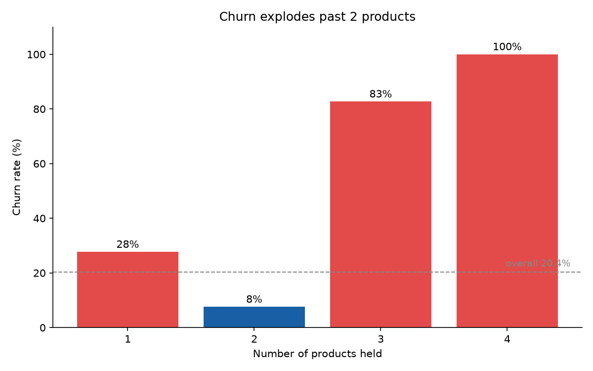
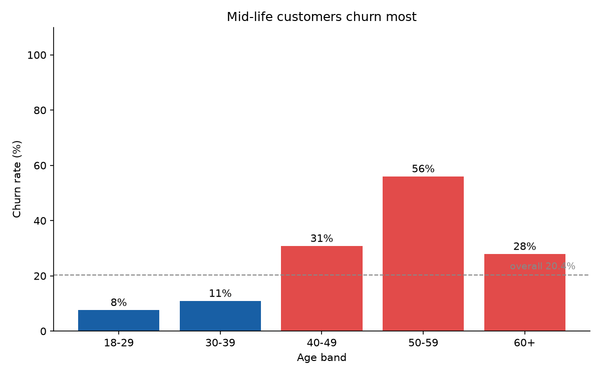
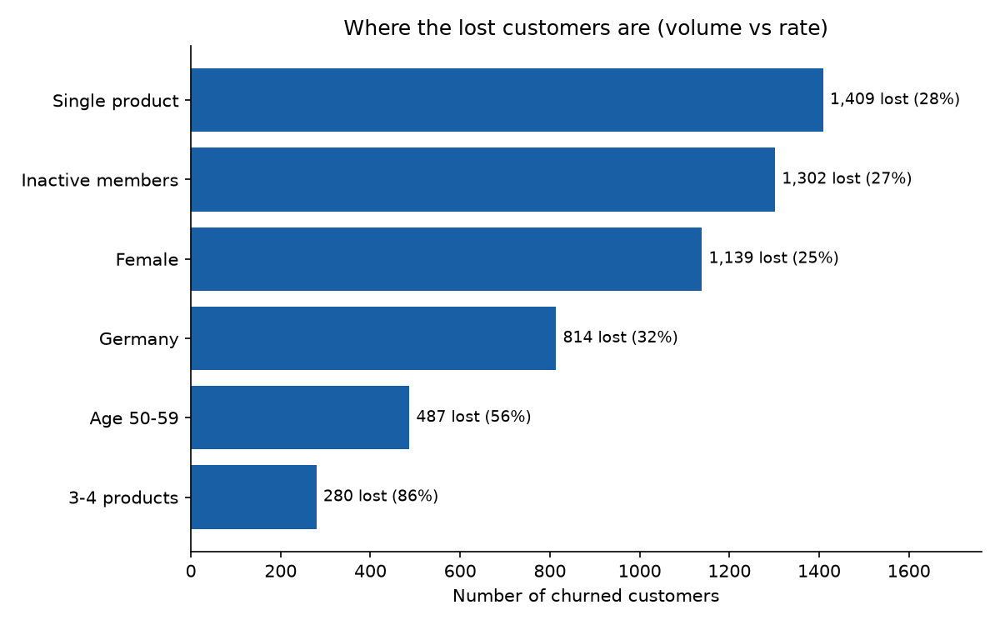

# Bank Customer Churn Analysis 🏦

Analysing **why a bank's customers leave**, and what to do about it — using SQL
to interrogate 10,000 customer records and Python to visualise the findings.

**Tools:** SQLite · Python (matplotlib)

---

## Bottom line (TL;DR)

**1 in 5 customers (20.4%) churned — but the loss is concentrated and fixable.**

- 🚨 **A broken multi-product journey:** customers with 3 products churn at 83%,
  and **every single customer with 4 products left (100%)** — an 86% churn rate
  across all 3–4 product holders. The "sweet spot" is 2 products (just 7.6%
  churn). Something about selling beyond 2 products is actively pushing people
  out — this needs an urgent audit.
- 📊 **The biggest volume of losses is elsewhere:** single-product customers
  (1,409 lost) and inactive members (1,302 lost) are where most churn actually
  happens. These are the segments to move first.
- 🇩🇪 **Germany is a problem market:** 32% churn, double France and Spain (~16%).

**If I owned this:** audit the 3–4 product experience immediately (small group,
near-total loss), while running activation and second-product campaigns at the
large single-product / inactive base, where small improvements save the most
customers.

## Recommendations

| # | Action | Why | Expected reach |
|---|--------|-----|----------------|
| 1 | **Audit the 3–4 product journey now** | 83–100% churn signals mis-selling or a broken experience | 326 holders (280 already lost) — small but near-total loss |
| 2 | **Activate inactive + single-product customers** | Largest pools of churn; 2 products = lowest churn (7.6%), so nudging a second product helps | ~2,700 churned customers between them |
| 3 | **Investigate Germany** | 2× the churn of other markets — pricing, fit, or competition? | ~814 churned customers |
| 4 | **Targeted retention for age 50–59 (56% churn) and female customers (25% vs 16%)** | Sharp, specific risk groups | ~1,600 churned customers |

## Key findings

**Churn explodes past 2 products** — the clearest and most counterintuitive signal:



**Mid-life customers churn most** — the 50–59 band peaks at 56%:



**Rate vs volume** — where the lost customers actually are (a high rate on a tiny
group loses fewer people than a moderate rate on a huge one):



| Segment | Customers | Churned | Churn rate |
|---------|----------:|--------:|-----------:|
| Single product (1) | 5,084 | 1,409 | 27.7% |
| Inactive members | 4,849 | 1,302 | 26.9% |
| Female | 4,543 | 1,139 | 25.1% |
| Germany | 2,509 | 814 | 32.4% |
| Age 50–59 | 869 | 487 | 56.0% |
| 3–4 products | 326 | 280 | 85.9% |

*(Segments overlap, so the churned counts do not sum to the 2,037 total.)*

## The data

Public **Bank Customer Churn** dataset (`Churn_Modelling.csv`) — 10,000 retail
bank customers with demographics, product holdings, activity, and an `Exited`
flag marking who left. A widely used dataset for churn analysis.
[Source](https://github.com/Dhillipkumar/Bank-Churn-Prediction-Model).

## How to reproduce

You need [SQLite](https://www.sqlite.org/) (pre-installed on macOS) and Python.

```bash
# 1. Create the table
sqlite3 churn.db < schema.sql

# 2. Import the CSV into it (skips the header row)
sqlite3 churn.db ".import --csv --skip 1 data/churn.csv customers"

# 3. Run the analysis
sqlite3 -header -column churn.db < queries.sql

# 4. Generate the charts
pip install -r requirements.txt
python3 make_charts.py
```

## Project structure

| File | What it does |
|------|--------------|
| `schema.sql` | Defines the `customers` table + a data dictionary |
| `data/churn.csv` | The raw dataset (10,000 customers) |
| `queries.sql` | The full churn analysis, written as SQL |
| `make_charts.py` | Reads the database and saves the charts |
| `charts/` | Generated chart images |

## What I learned

SQL: importing a CSV, computing rates with `SUM`/`COUNT`, bucketing with `CASE`,
combining segments with `UNION`, and segment analysis. Python: reading a SQLite
database and charting with matplotlib. Analysis: the difference between **rate
and volume**, and turning findings into prioritised recommendations.
